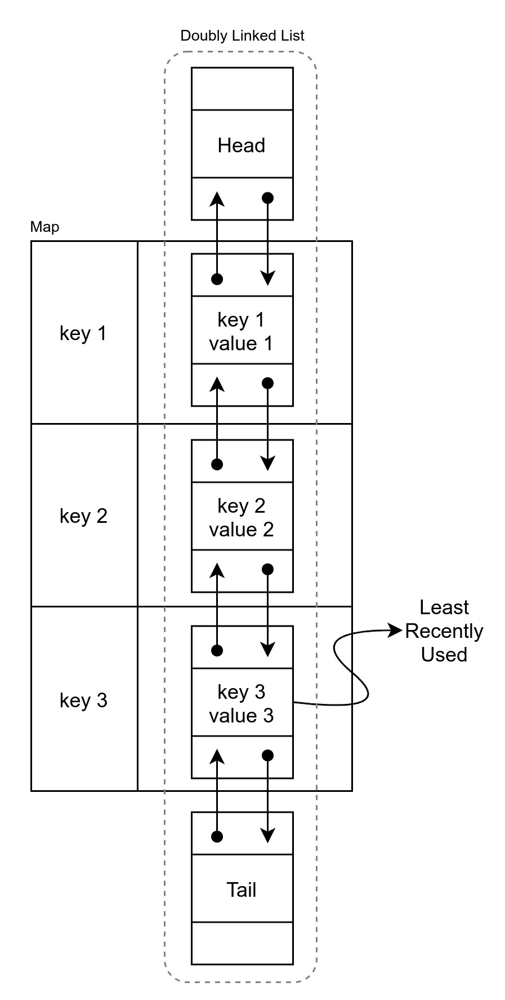

<p style="text-align: center;">
  A production-ready TypeScript implementation of Least-Recently Used (LRU) 
Cache.
</p>

# Least-Recently Used (LRU) Cache

An LRU Cache is a limited-size key-value pair data structure that arranges
entries in order of use. When adding new keys causes the capacity to be
exceeded, the Least-Recently Used entry gets identified and discarded.

## Installation

```bash
$ npm install @saaniaki/lrucache --save
```

## Usage

A new instance of `LruCache` can be created as the following, and the maximum
capacity needs to be set at the construction time:

```typescript
const lruCache: ILruCache = new LruCache(capacity);
```

For stricter type safety, `LruCache<K, V>` has been made to accept
generics `<K, V>` where `K` is the entries key type and `V` is the Entry values
type. For example:

```typescript
const lruCache: ILruCache<string, string> = new LruCache(capacity);
```

Once the Cache is instantiated, items can be cached, updated, retrieved or
removed as the following:

```typescript
// Caches a new or updates an exiting entry (myKey => chachedValue).
lruCache.put('myKey', 'chachedValue');

// Retrieves an already cached value where the entry key matches the passed key.
const chachedvalue: string = lruCache.get('myKey');

// Deletes an already cached value where the entry key matches the passed key.
const deletedValue: string = lruCache.delete('myKey');
```

> Both _reading_ and _writing_ the value of a key are considered a _use_ of
> that key and cause the entry to get moved to the top of the Cache.

The Cache instance can also get reset at anytime as the following:

```typescript
// Resets the cache and discards all the cached items.
lruCache.reset();
```

Other than the four main methods mentioned above, the following properties and  
methods can also be useful when the transpile-time instance is `LruCache`:

```typescript
// Returns the number of currently Cached entries.
lruCache.size;

// Checks if emptiness of the Cache.
lruCache.isEmpty();

// Represent the LRU Cache as a string.
lruCache.toString();

// The LruCache is an iterable object and can be iterated with a for-of loop:
for (const entry of lruCache) {
    // entry[0] is the key of type K and entry[1] is the value of type V.
    const [key, value] = entry;
}
```

## Extending

The `ILruCache` interface exist to make it easy to introduce new implementations
of the LRU Cache and to assure compatibility with the existing test cases. After
forking this repository, extend the `ILruCache` and start the implementation:

```typescript
export class YourLruCache<K, V> implements ILruCache<K, V> {
    // ...implementation
}
```

While developing, it makes life easier to run the TypeScript in watch mode. You
can do so by running `npm run build:watch` and to start execution, run
`npm start`.

To test an implementation of the `ILruCache` interface, modify the `factory`
function located at `test/factory.ts` to return an instance of the new
implementation and simply run `npm test`.

Finally, when everything is ready to get shipped to the production,
run `npm build:prd`, commit your code and tag it as a new release!

## Dependencies

This repository only has dev dependencies, and they are as the following:

1. **ESLint**: to lint the project with the recommended TypeScript rules. Please
   take a look at `.eslintrc.js` for more details.
2. **Prettier**: to format the code in a consistent way. Prettier is connected
   to the ESLint and follows the same rules. Please take a look
   at `.prettierrc.js` for more details.
3. **Jest**: to test correctness the implementation and assure the robustness of
   the code. Jest has been set up to run the transform the TypeScript files and
   run them directly, please take a loot at `jest.config.js`. All the test cases
   are located in the `test` folder.

## Solution and Runtime Analysis

The current LRU Cache implementation combines a Map and a Doubly Linked List to
achieve a good performance. To track the usage of entries and rank by frequency
of it a Doubly Linked List is a pretty good choice since items can be added and
removed from top and bottom of the list cheaply and fast.

> Let's agree that the top, beginning or head of the list holds the Most
> Recently Used entry and the bottom, end or tail of the list holds the Least
> Recently Used entry.

However, a Doubly Linked List doesn't have the best performance when in comes to
random access either via indices or keys. Inserting to and removing from Head
and Tail in a Doubly Linked List is Ω(1), Θ(1) and O(1) but accessing and
searching is Ω(1) and O(n) which can be improved using a Map. Accessing and
searching a Doubly Linked List has a Θ way higher than a Map. The amortized Θ of
a Map is Θ(1). Therefore, a Map can be helpful if combined with the Doubly
Linked List.

To achieve an optimal structure, the `LruCache` does not encapsulate the Map and
the Doubly Linked List, and instead it combines the two into one data structure.
That is, it creates the Doubly Linked List Nodes inside the Map and encapsulates
the user-entered values into the created Node. The diagram below visualizes this
combination:



Each LRU Cache Node also stores the key of the Map entry to create a link back
to the Map. This comes handy when trying to discard the Least-Recently Used
entry; this results in having a delete operation with time complexity of Ω(1), Θ
(1) and O(n).

The summary of time complexity of the LRU Cache operations is as the following:

| Operation |  Ω   |  Θ   |  O   |
|-----------|:----:|-----:|-----:|
|    put    | Ω(1) | Θ(1) | O(n) |
|    get    | Ω(1) | Θ(1) | O(n) |
|   delete  | Ω(1) | Θ(1) | O(n) |
|   reset   | Ω(1) | Θ(1) | O(1) |
|  capacity | Ω(1) | Θ(1) | O(1) |
|    size   | Ω(1) | Θ(1) | O(1) |
|  isEmpty  | Ω(1) | Θ(1) | O(1) |

> NOTE: Although, the put, get and delete of O(n), the worst case scenario is an
> extreme case and one should take the amortized (average) case Θ(1) in
> consideration. Today's hashing algorithms work extremely well and have a
> super low chance of collisions.

## About the Author

I am Ali Niaki :nerd_face: and I'm in love with secure, extendable performant
code!
